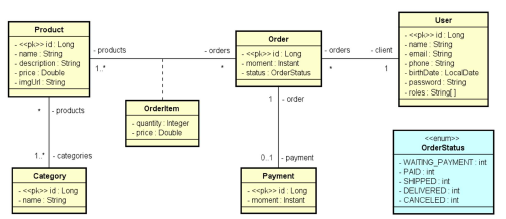
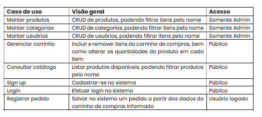

 ## Projeto Java Spring : Loja Virtual

 
Projeto Loja Virtual desenvolvido durante os estudos do curso Java Spring Professional.

### 🚀  Tecnologias

Tecnologias utilizadas no desenvolvimento do Projeto:

### Modelo Conceitual:

### Casos de uso (visão geral) :

​    
​    
